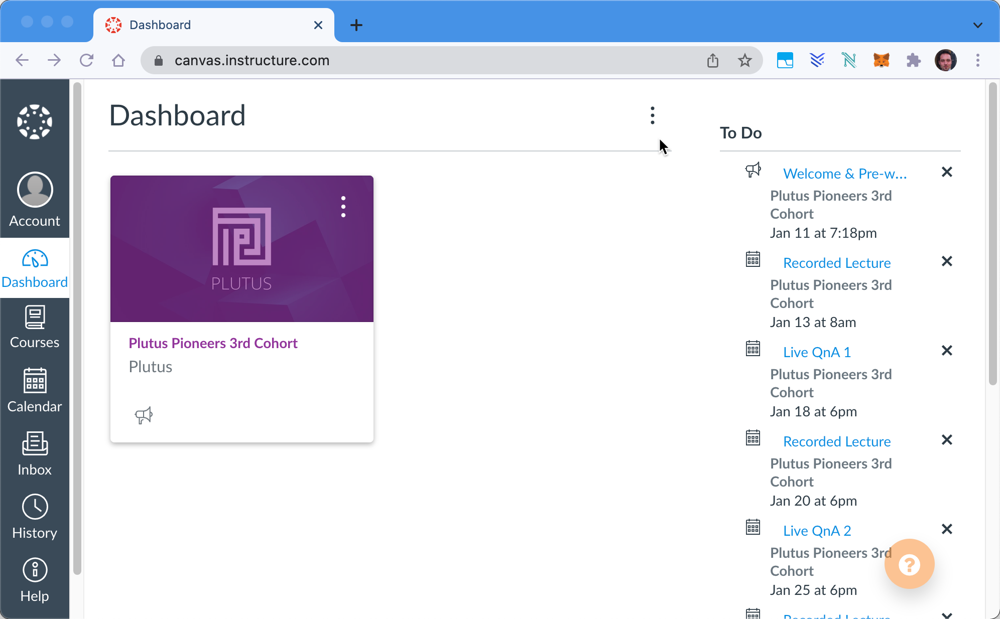

= PPP #3 Course Material

:toc:

This folder contains information about the Plutus Pioneers Program #3rd Cohort.
Please note: 

* Main material: https://github.com/input-output-hk/plutus-pioneer-program
* Canvas course: https://canvas.instructure.com/courses/4089198
* Information provided here is just a summary

== Pre-reading

Some prior knowledge of Haskell or functional programming is advisable for this course, and we suggest that newcomers to Haskell read https://freecomputerbooks.com/Learn-You-a-Haskell-for-Great-Good.html[Learn You a Haskell guide in preparation].

== Course Topics

As mentioned in our updated application page, the course covers the following areas:

* Functions and data types
* Type classes
* Monads
* Template Haskell
* Using the Plutus Playground
* Extended UTXO model
* Working with Plutus (on and off the chain)
* Minting policies
* State machines
* The Plutus application framework (PAF)
* The Plutus application backend (PAB)
* Some case studies and practical exercises

== I didn't register.

The course remains relatively open. Those who have not registered will be able to participate in the pioneer discord channels and can access all the main course materials. 

If you missed the boat or just want to dabble, the https://github.com/input-output-hk/plutus-pioneer-program/blob/main/README.md[Plutus Pioneers repository] will be your best point of departure once course materials are released. 

== Plutus Pioneers is here

=== 1. Discord

In the IOG technical community Discord server, you will have a place to discuss the course and its materials with fellow Pioneers:

* Join the discord server using this https://discord.com/invite/WmSVtQ5PjZ[invitation link]. You will have to complete verification.
* Once that is finished, add yourself to the Pioneers Third Cohort by using the green check react https://iohk.us20.list-manage.com/track/click?u=26d3b656ecc43aa6f3063eaed&id=8491b2183c&e=1a9685e45f[here].

=== 2. Canvas

Canvas is where all course materials will be aggregated. Use this https://iohk.us20.list-manage.com/track/click?u=26d3b656ecc43aa6f3063eaed&id=714711d773&e=1a9685e45f[link] to confirm your enrollment there. 

* https://canvas.instructure.com/

=== 3. Cardano Stack Exchange

We encourage pioneers to use Cardano Stack Exchange (CSE) to post questions and record solutions.  

* If you don't already have one, make yourself a CSE account (https://cardano.stackexchange.com/[sign up]).
* Bookmark (_Watch_) the https://cardano.stackexchange.com/questions/tagged/plutus-pioneer-program[Plutus Pioneers tag], where all pioneer-related CSE questions are aggregated.
Once you begin contributing to CSE, you will earn reputation and editorial powers to further curate knowledge about Cardano. 

=== 4. Github

The Plutus Pioneers github https://github.com/input-output-hk/plutus-pioneer-program[repository] is where the actual Plutus code for each module will reside. 