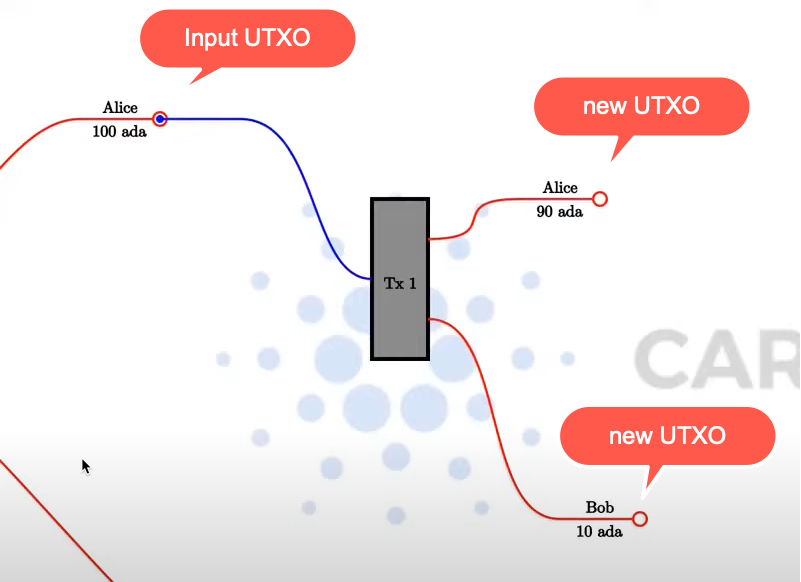

= Lesson 01 

== https://www.youtube.com/watch?v=X80uNXenWF4&list=PLNEK_Ejlx3x2nLM4fAck2JS6KhFQlXq2N[Welcome and Introduction]

Plutus is so new that the tooling is less than ideal. Also, since you are among the first people in the world doing Plutus, is not common that you find the answers that you are searching on internet.

Best practices: we are in the very early steps, and we have the opportunity to explore together the possibilities and establish the best practices. 

The eUTXO has a lot of advantages compared to the Accounting model of Ethereum (e.g. you can build transactions locally), but requires a new way of thinking, that is different w.r.t. classing smart contract. 

Plutus is based on Haskell. For on-chain, then you need to know pretty basic Haskell. But if you want to write PAB (Plutus Application Backend), then the level of Haskell that you need is more advanced. (Anyway, the Haskell PAB exposes a REST API that we can use to interact in any language)

For those who need a slower-pace intruduction to Haskell or want to brush up their Haskell, they can use the video course taught virtually by Lars in Mongolia

* https://www.youtube.com/playlist?list=PLJ3w5xyG4JWmBVIigNBytJhvSSfZZzfTm

Even if you are a seasoned Haskell developer, Plutus does not come with all the tools that you usually expect from Haskell. Something does not work, e.g. normally in the haskell wrapper you get type information (check signatures) but that is not working with plutus because of a plugin used for Plutus. 

Also, it is not easy to set up the dependencies to build Plutus. But anyway, we are using NIX, and except for the first time setup, the latter ones will be simpler. 

== https://www.youtube.com/watch?v=bfofA4MM0QE&list=PLNEK_Ejlx3x2nLM4fAck2JS6KhFQlXq2N&index=2[The (E)UTXO Model]

* BTC : UTXO (Unspent Transaction Output)
* ETH : Accounting Model
* Cardano : eUTXO

A transaction has an arbitrary number of inputs and outputs. You can use only whole UTXO(s) as input. When the transaction is complete, it produces other UTXO(s) as output, while the inputs are "Spent". 

So assume Alice has 100 ADA and want to send 10 to Bob. She cannot send only 10 ADA to bob, but must send the entire UTXO to the transation. The Transaction consumes entire UTXO and creates two UTXO outputs: one of 10 ADA for Bob and another with the change of 90 ADA for her. 

